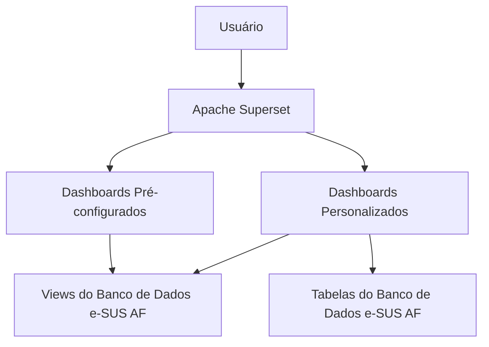

# COMPONENTES ACESSÓRIOS AO e-SUS AF

Como relatado no documento de introdução, os componentes acessórios são aqueles que estendem os recursos do sistema e garantem funcionalidades adicionais à aplicação. Estes componentes possibilitam tem funções variadas atuando
em inúmeras frentes.  
A escolha der quais componentes acessórios utilizar é do gestor de infraestrutura e, para esta definição, deve-se considerar o porte da aplicação, a infraestrutura disponível e as necessidades de monitoramento e gestão do sistema.  
A seguir, listamos os componentes acessórios que podem ser utilizados com o e-SUS AF.  

## Apache Superset

O Apache Superset é uma plataforma de visualização de dados que permite a criação de dashboards e relatórios interativos.  
Ele pode ser integrado ao e-SUS AF para fornecer uma interface de visualização dos dados, facilitando a análise e interpretação das informações possibilitando a criação de gráficos, tabelas e outros elementos visuais que ajudam na tomada de decisões.  
Faz parte do conjunto de ferramentas de Business Intelligence (BI) e é uma opção popular para visualização de dados em ambientes corporativos.  
O banco de dados do e-SUS AF é munido de um conjunto de views que podem ser utilizadas para a criação de dashboards e relatórios no Apache Superset, estas views são criadas e mantidas pelo próprio e-SUS AF, garantindo que os dados estejam sempre atualizados e consistentes.  
para além das views disponibilizadas, é possível acessar diretamente as tabelas do banco de dados, permitindo uma flexibilidade maior na criação de visualizações personalizadas sw forma a tirar máximo proveito dos recursos avançados de filtragem, agrupamento e drill-down, permitindo que os usuários explorem os dados de forma interativa.  
O Repositório do BI e-SUS AF oferece uma série de dashboards pré-configurados que podem ser utilizados como ponto de partida para a criação de visualizações personalizadas, facilitando a análise de dados e a tomada de decisões informadas.  

